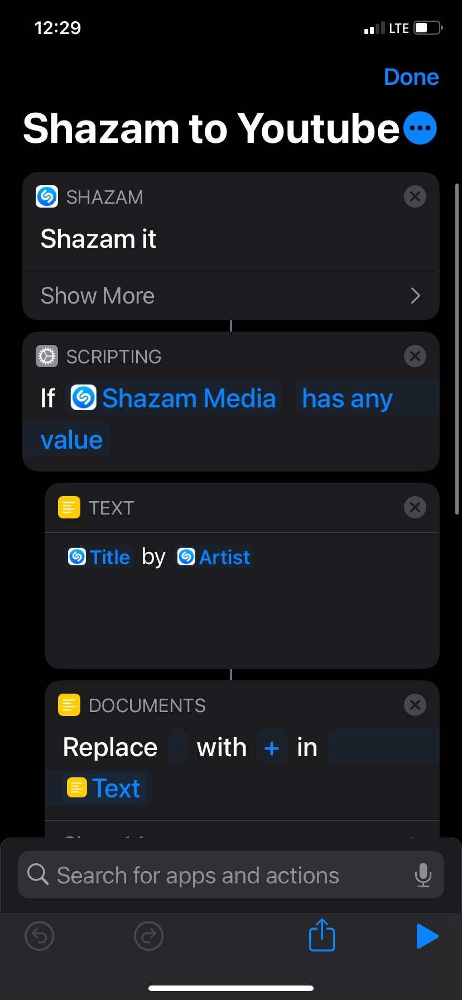
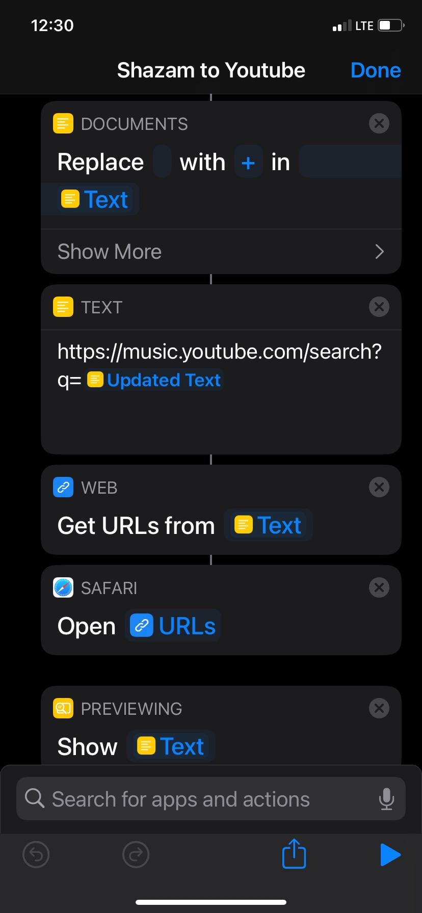
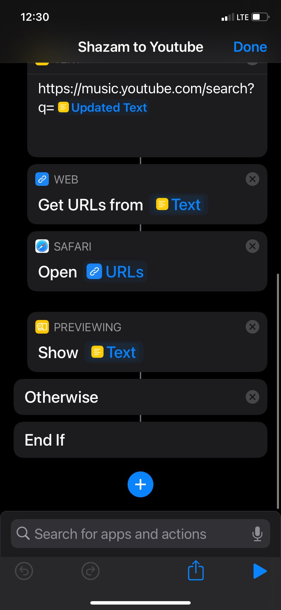

# Shazam to Youtube Music

This Shortcut is a way to make *shazam integrate with youtube music*. Essentially, you use a shortcut that launches shazam, then queries youtube musics search using string concatenation and replacement. Check it out below!

Click the Icloud <a href="https://www.icloud.com/shortcuts/30b05cebef2d40579903b283301faf96">link</a> to download.

